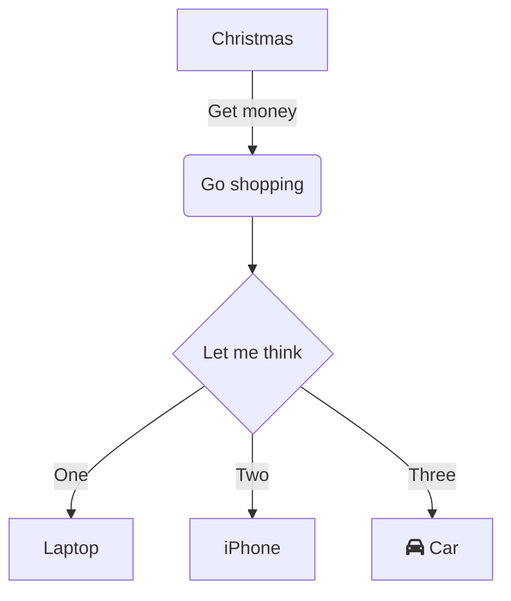

# WSA Notes

> The notes are based on my reading and watching video from different sources including but not limited to paid & proprietary resources/content. \
> The notes are for my reference and the content is mixed from different sources including my understanding of the system.\
> I am not claiming any copyright and the fragments of text, etc. belong to the respective owners.

### FAQs:

#### About Platform and Why this?

Gitbook has markdown based editor which is easier as a developer and it sync content with github, and hence I own the content and in future I could switch to whatever I like.

