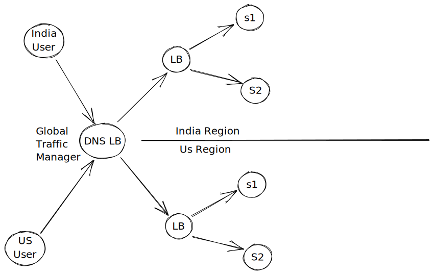
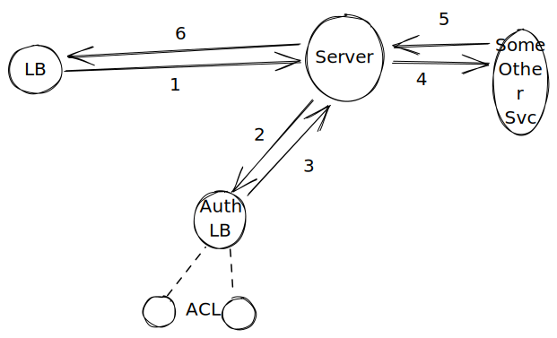

# Components Solution

### Static Content

* Store the static content on a blob store
* Add A CDN in front of it, for global availability and caching

Blob  store - AWS S3, GCS (Google Cloud Storage)

CDN - Cloudflare, GC CDN

### API

For Multiple Region: DNS Load-balancer

Based on the user region, it returns IP Address for that specific region

#### For independent API modules

Example, Auth, Payment, Code Execution, CRUD -> These are different and should not affect one another

> Do A Path Based Load Balancing

#### For Access Control based on the API Path

Approach 1:

* It could make another API Call (ACL) to retrieve the API Calls

Approach 2:

* Add a Middleware / Gateway, that validates that, and then attach some information in the Requests.
