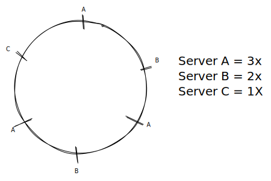

# Load Balancer

A type of reverse proxy that distributes traffic over servers.

#### When Adding  a New Server

#### When removing a server

For the above diagram, if we remove server E, only one request(R5), will be redirected to server A

#### What if one server is more powerful than the others (consider for weight)

Place the powerful server multiple times on the circle.

### Hashing

#### Consistent Hashing

A type of hashing that minimizes the number of keys that need to be remapped when a hash table gets resized. Its often used by load balancers to distribute traffic to servers; it minimizes the number of requests that get forwarded to different servers when new servers are added or when existing servers are brought down.

#### Rendezvous Hashing

A type of hashing also coined highest random weight hashing. Allows for minimal re-distribution of mappings when a server goes down.

#### SHA

Short for "Secure Hash Algorithm", the SHA is a a collection of cryptographic hash functions used in the industry. These days, SHA-3 is a popular choice to use in a system.

