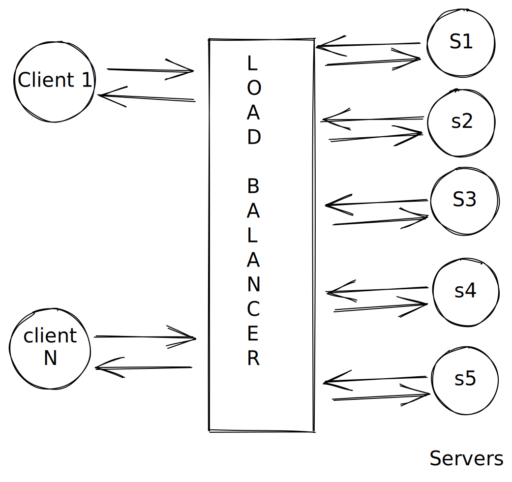
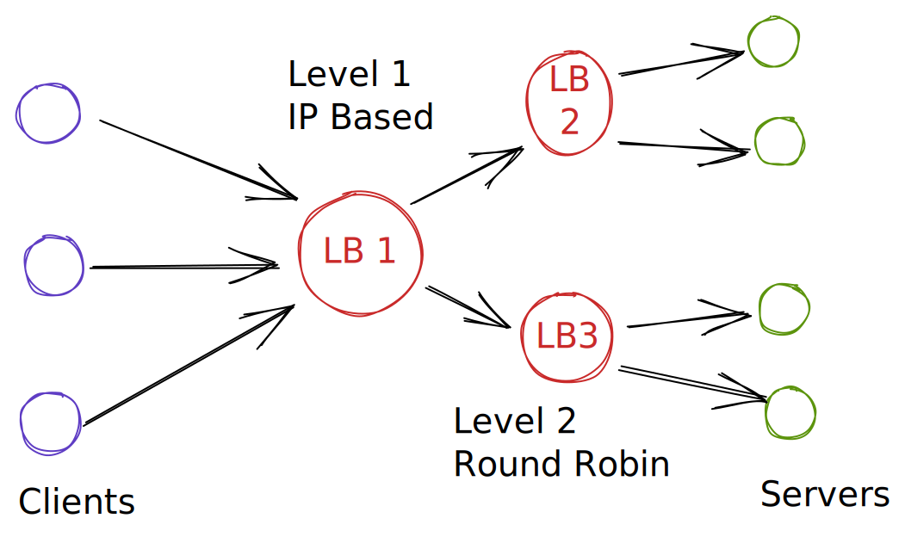
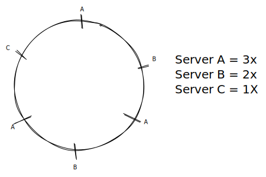

# Load Balancer

A type of reverse proxy that distributes traffic over servers.



####

### Multi-Layered Load balancer



### Server Selection Strategy

* Round Robin
* Random Selection
* Performance based selection\
  Application Server Load Aware Load Balancer
* Hashing based
  * IP based routing (hash the IP)
  * Session key for hash
* Request Path&#x20;

### DNS Load-balancing

Same domain resolves to multiple IPs


### Examples

#### Example 1:

Load-balancer exposed at port 3000, and re-directs the request to port 3001 and 3002.&#x20;

Redirection is done via weighted-round-robin strategy.

```nginx
events {}
http {
 upstream nodejs-backend {
   server localhost:3001 weight=3;
   server localhost:3002;
 }
 server {
   listen 3000;
   location / {
     proxy_set_header some_internal_key value;
     proxy_pass http://nodejs-backend;
   }
 }
}
```

#### When Adding  a New Server


#### When removing a server

For the above diagram, if we remove server E, only one request(R5), will be redirected to server A

#### What if one server is more powerful than the others (consider for weight)

Place the powerful server multiple times on the circle.



### Hashing

#### Consistent Hashing

A type of hashing that minimises the number of keys that need to be remapped when a hash table gets resized. It's often used by load balancers to distribute traffic to servers; it minimises the number of requests that get forwarded to different servers when new servers are added or when existing servers are brought down.

#### Rendezvous Hashing

A type of hashing also coined `highest random weight hashing`. Allows for minimal re-distribution of mappings when a server goes down.

#### SHA

Short for "Secure Hash Algorithm", the SHA is a a collection of cryptographic hash functions used in the industry. These days, SHA-3 is a popular choice to use in a system.


