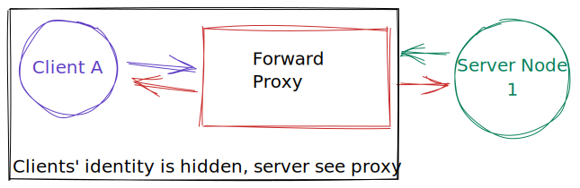

# Proxies

### Reverse Proxy

Reverse proxy interact with the client on behalf of the server.

Server identity is hidden from the client.

Nginx is one of the most popular Reverse proxy server.

Eg. **Load balancer, CDN, etc.**

For a system design, a reverse proxy can do a lot of things:

* Logging of the requests
* Ignoring requests
* Acts as a cache
* As a load balance

### Forward Proxy

Client asks the forward proxy to communicate with the server on its behalf.

Client identity is hidden from the server.

Example: **VPN**


test

