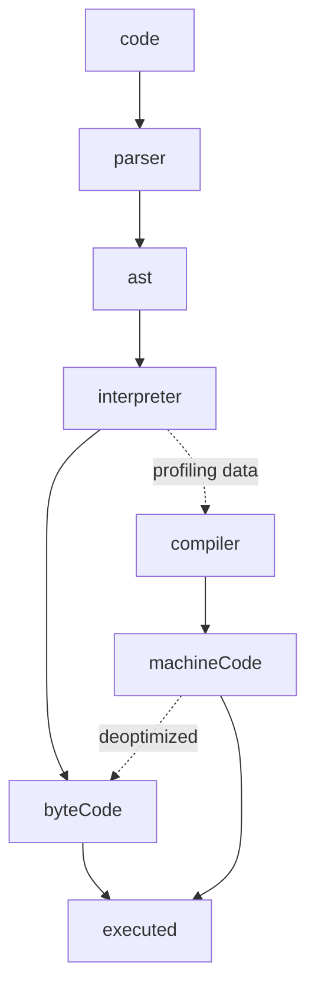

# V8: JS Engine

Some text

```mermaid
graph TD
    code --> parser
    parser --> ast
    ast --> interpreter
    interpreter --> byteCode
    compiler --> machineCode
    interpreter -. profiling data.-> compiler
    machineCode -. deoptimized.-> byteCode
    byteCode --> executed
    machineCode --> executed
```

### References

V8 Internals




Engine structure



Engine Structure - More details


#### JS Parsing


Js Parser in V8

