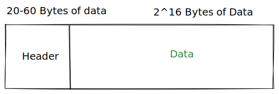

# Component's Architecture


### Layers

1. User Interface (UI) / Service Interface (APIs)
2. Business Logic (BL)
3. Data Access Layer (DAL)

Each layer should be insulated and should not expose information about its internal workings

#### Code Flow

* One layer could call only the next layer.
* A layer can not call its upper layer.

Valid Flow

UI -> BL -> DAL

In correct examples:

* Upward flow: DAL -> BL, BL -> UI / SI
* Skip level calls: UI -> DAL

#### Loose Coupling between Layers

Directly calling methods/functions from another layer, will create tight coupling.

* Dependency Injection

Example of tight coupling.

```javascript
// Inside a Business Logic Layer
DAL dal = new DAL()
var entity = dal.GetData(101)
```

#### Exception Handling between Layers

Example: When exception is initiated by a component (SQL Connector) within DAL Layer

Eg. Let say, DAL layer gets an MySQL exception. It should not throw an `MySQLException` instead, it should handle it within by analyzing the exception, loggin it and then throwing another generic Exception `DataException` to the Business Layer.

DAL Layer Should:

* Analyse the exception
* Log it
* Thow a Generic Exception (Data Exception and not the received ~~MySQLException~~)




### Interfaces

> New is Glue. \
> Whenever you use the new keywork, it creates a tight coupling.

### Dependency Injection

> A technique whereby one object, supplies the dependencies of another object.

Makes the code modular, flexible and easy to maintain.

* Injection via factory methods
* Constructor Injection

### SOLID

* Coined by Bob Martin in 2000

#### Single Responsibility Principle

Each class, module or method should have one and only one responsibility.

Eg. Logging Engine

* What should be written?
* Where should it be written?

#### Open/Closed Principle

#### Liskov Substitution Principle

#### Interface Segregation Principle

#### Dependency Inversion Principle


### FAQs

#### Layers Vs Tiers

Layers:

* Within a given Component/Service how does different things communicate.&#x20;
* All the layers shares the same computing resource

Tiers:

* How different components communicate with each other, generally via a Network request.
* Distributed piece of code deployed independently in a network.
